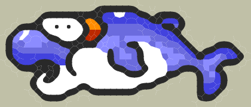

# Depixelize PixelArt
Depixelize lets you to create beautiful looking anti aliased images using the 1990s pixel art.
An implementation of the algorithm stated in '[Depixeizing Pixel Art](http://johanneskopf.de/publications/pixelart/)' by Johannes Kopf and Dani Lischinski published in [SIGGRAPH 2011](http://www.siggraph.org/s2011/).

## Summary
The algorithm is divided into following parts -
* Input the image
* Initialize the similarity graph on the basis of pixel colors
* Resolve crossing edges using different heuristics
* Create voronoi regions using the similarity graph
* Extract B-spline curves and optimize

## Examples
Input:


Output:



## Building
Make sure you have CMake installed. Install any recent version (>= 3.15.0) of CMake.

### With OpenGL
If you are compiling with `-DCOMPILE_OPENGL=ON`, you will need the following
* [OpenGL](https://www.opengl.org/)
* [GLUT - The OpenGL Utility Toolkit](https://www.opengl.org/resources/libraries/glut/)
For glut:
#### On Linux
```
sudo apt install freeglut3-dev
```
#### On Windows
Download glut libraries from [here](https://www.transmissionzero.co.uk/software/freeglut-devel/) (MSVC or MinGW according to the compiler present on your system) and extract it in a folder. Then, use GLUT_ROOT_PATH variable to use the downloaded package.

### Steps to build
```
cmake -H. -Bbuild
# Add -DCOMPILE_OPENGL=ON -DGLUT_ROOT_PATH=<path/to/glut/installation> if required.

cmake --build build

# Binary should be present at ./build/depixelize-*
# NOTE: On windows, the GLUT DLLs are copied alongside the binary, thus if you moe the binary, you want to move them together
cmake
```
## Running
```shell
./build/depixelize-gl ./test/dolphin.bmp
./build/depixelize-svg ./test/dolphin.bmp ./test/dolphin.svg
```
## Acknowledgments
* [Depixelizing Pixel Art](http://johanneskopf.de/publications/pixelart/) by Johannes Kopf and Dani Lischinski]
* [YUV/RGB Conversion formulas](http://www.pcmag.com/encyclopedia/term/55166/yuv-rgb-conversion-formulas)
* BMP loading library from [sol-prog/cpp-bmp-images](https://github.com/sol-prog/cpp-bmp-images)
* SVG Creation library from [adishavit/simple-svg](https://github.com/adishavit/simple-svg)